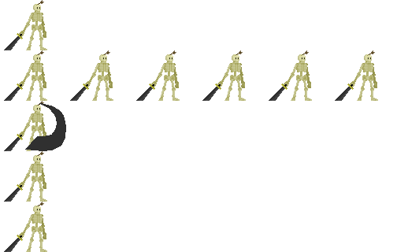
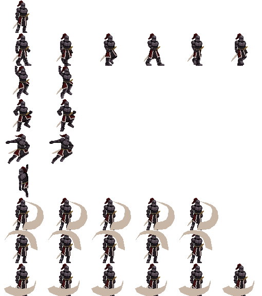

# Woche 10

## Zusammenfassung

Diese Woche ging die Entwicklung in die Endphase. Der erste Bossgegner wurde mit einem individuellen Verhalten hinzugefügt. Außerdem wurden die Collideranpassungen für den Spieler auch auf die Gegner angewandt. Der restliche Fortschritt war rein grafischer Natur. 

## Boss / Endgegner 

Um dem Spiel ein kleines Ende zu geben, habe ich diese Woche einen Boss Gegner erstellt. Dieser hat ein Bewegungsmuster, welches anhand von bestimmten Regeln verfolgt wird. Der Boss besteht aus drei Phasen. Umso höher die Phase umso schwieriger wird der Gegner. Der Gegner ist vom Verhalten dem False Knight aus dem Spiel Hollow Knight nachempfunden. Die Aktionen sind gleich nur die Entscheidung, wann diese ausgeführt werden sind nicht immer korrekt. 

### Bewegungsmuster

Das Muster besteht aus sechs verschiedenen Aktionen: 

* Rage: Erreicht das Leben des Gegners eine bestimmte Zahl oder unterschreitet diese springt der Gegner in die Mitte der Arena und schkägt links und rechts abwechselnd neben sich auf den Boden. Ab Phase 2 fallen Gegenstände von der Decke (Kommt nächste Woche). In Phase 3 steigt die Anzahl der Gegenstände. 
* Leap: Um sich neu zu positionieren, springt der Gegner entweder ein kleines Stück nach vorne oder nach hinten. Die Richtung des Sprunges ist von der Distanz zwischen dem Boss und dem Spieler abhängig. Nach dem Sprung wird die Aktion Slam ausgeführt. 
* Slam: Der Gegner schlägt mit seiner Waffe vor sich auf den Boden. Beim Aufschlag auf den Boden wird eine Druckwelle nach vorne geschickt (Druckwelle kommt auch morgen). 
* Charge: Beim Charge geht der Gegner zum Spieler hin oder vom Spieler weg. Die Richtung ist wieder von der Distanz zum Spieler abhängig. Der Gegner positioniert sich so, dass der Spieler in Reichweite für die Aktion Leaping Bludgeon ist.
* Leaping Bludgoen: Der Gegner springt auf die Position des Spielers beim Start des Sprunges und schlägt mit seiner Waffe auf den Boden. Ab Phase 2 fallen auch hier Gegenstände von der Decke und die Anzahl der Gegenstände wird bei Phase 3 mehr. 
* Cooldown: Nach jeder vollständigen Aktion wechselt der Gegner in den Cooldown Zustand. In diesem Zustand wartet der Gegner eine gewisse Zeit bis er die nächste Aktion startet. 

### Rage 

```c++
else if (state->currentState == rage) {
		if (SDL_GetTicks() - tickStart >= rageAttackDuration) {
			rageAttackCount++;			
			tickStart = SDL_GetTicks();
			if (transform->direction == right) {
				transform->direction = left;
			}
			else if (transform->direction == left) {
				transform->direction = right;
			}
			if (rageAttackCount == rageAttackMax) {
				tickStart = SDL_GetTicks();
				state->setState(cooldown);				
				if (Game::player.getComponent<TransformComponent>().position.x + Game::player.getComponent<TransformComponent>().width / 2 >= transform->position.x + transform->width / 2) {
					transform->direction = right;
				}
				else {
					transform->direction = left;
				}
			}
		}
	}

(...)

void BossBehaviour::startRage() {
	transform->velocity.x = 0; 
	transform->velocity.y = 0; 
	transform->direction = right;
	tickStart = SDL_GetTicks();
	rageAttackCount = 0;
	state->setState(rage);
}

void BossBehaviour::startRageJump() {	
	if (state->currentState != idle) {
		nextState = rageJump; 
	}
	else {	
		nextState = idle; 
		int jumpHeight = 80; 

	    int t = 69; 		
		float s = ((WINDOW_WIDTH - transform->width) / 2 - transform->position.x) / t / transform->speed;
		
		transform->velocity.x = s; 
		transform->velocity.y = static_cast<float>(-jumpHeight);
		state->setState(rageJump);
    }
}

(...)

if (state->currentState == rageJump) {
		if (cn.x == 0 && cn.y == -1) {
			transform->velocity.x = 0;
			transform->velocity.y = 0;
			startRage();
		}
	}
```

Der Sprung in die Mitte ist ein eigener Zustand des Bosses. Die Sprunghöhe ist immer die gleiche und somit ist auch die Sprungdauer immer die gleiche. Die Geschwindigkeit des Sprunges wird beim Start des Sprunges berechnet damit der Gegner immer in der Mitte der Arena landet. Das passiert mithilfe der t Variable. t ist die Anzahl der Frames bis der Sprung beendet ist. Der Wert ist nicht berechnet sondern durch Zählen der Frames bei einem Testdurchlauf entstanden. Bei einer Kollision mit dem Boden wird die Rage Aktion ausgeführt. Während des Rages schlägt wechselt die Angriffsrichtung von links nach rechts hin und her. Nach der Anzahl an Angriffen wechselt der Gegner in den Cooldown Zustand. 

### Leap

```c++
void BossBehaviour::startLeap() {	
	Vector2D pos = { (parent->getComponent<TransformComponent>().position.x + parent->getComponent<TransformComponent>().width) / 2,  (parent->getComponent<TransformComponent>().position.y + parent->getComponent<TransformComponent>().height) / 2 };
	Vector2D playerPos = { (Game::player.getComponent<TransformComponent>().position.x + Game::player.getComponent<TransformComponent>().width) / 2,  (Game::player.getComponent<TransformComponent>().position.y + Game::player.getComponent<TransformComponent>().height) / 2 };;
	Vector2D dist = { playerPos.x - pos.x, playerPos.y - pos.y };
	int d = sqrt(dist.x * dist.x + dist.y * dist.y);
	if (dist.x >= 0) {
		transform->direction = right; 
		if (d >= slamRange) {
			transform->velocity.x = 0.5;
		}
		else {
			transform->velocity.x = -0.5;
		}
	}
	else {	
		transform->direction = left;
		if (d >= slamRange) {
			transform->velocity.x = -0.5;
		}
		else {
			transform->velocity.x = 0.5;
		}
	}	
	leapCounter++; 
	transform->velocity.y = static_cast<float>(-40);
	state->setState(leaping);
}
```

Die Weite des Sprunges ist fest. Die Beschleunigung wird immer auf 1 oder -1 gesetzt. Die Richtung wird entschieden ob der Spieler in Reichweite des nächsten Angriffes ist. Er positioniert sich so, dass der Spieler angegriffen werden kann, wenn dieser nicht zu weit entfernt ist. 

### Slam

```c++
else if (state->currentState == slam) {		
		if (SDL_GetTicks() - tickStart >= slamDuration) {
			tickStart = SDL_GetTicks();
			state->setState(cooldown);	
			if (Game::player.getComponent<TransformComponent>().position.x + Game::player.getComponent<TransformComponent>().width / 2 >= transform->position.x + transform->width / 2) {
				transform->direction = right;
			}
			else {
				transform->direction = left; 
			}
		}
	}

void BossBehaviour::startSlam() {
	leapCounter == 0; 
	state->setState(slam);
	tickStart = SDL_GetTicks();
}
```

Das ist nur ein einfacher Angriff in die aktuelle Blockrichtung. 

### Charge 

```c++
else if (state->currentState == charge) {
		if (transform->direction == right) {
			if (transform->position.x >= target.x) {
				transform->velocity.x = 0; 
				startLeapingBludgeon();
			}
		}
		else {
			if (transform->position.x <= target.x) {
				transform->velocity.x = 0;
				startLeapingBludgeon();
			}
		}
	}
	
	(...)

void BossBehaviour::startCharge() {	
	state->setState(charge);
	if (Game::player.getComponent<TransformComponent>().position.x >= transform->position.x) {
		target = { (Game::player.getComponent<TransformComponent>().position.x - bludgeonRange) - (transform->width / 2), transform->position.y };
	}
	else {
		target = { (Game::player.getComponent<TransformComponent>().position.x + bludgeonRange) - (transform->width / 2), transform->position.y };
	}
	if (target.x >= transform->position.x) {
		transform->velocity.x = 1; 
	}
	else {
		transform->velocity.x = -1;
	}	
}
```

Der Gegner bewegt sich so, dass der Spieler zu diesem Zeitpunkt genau in Reichweite des Sprungangriffes ist. 

### Leaping Bludgeon 

```
void BossBehaviour::startLeapingBludgeon() {		
	state->setState(leapingBludgeon);
	leapCounter = 0; 
	int t = 69;
	float s = ((Game::player.getComponent<TransformComponent>().position.x + Game::player.getComponent<TransformComponent>().width/2) - transform->position.x) / t / transform->speed;
	transform->velocity.x = s; 
	transform->velocity.y = static_cast<float>(-80);
	if ((Game::player.getComponent<TransformComponent>().position.x + Game::player.getComponent<TransformComponent>().width / 2) >= transform->position.x + transform->width / 2) {
		transform->direction = right;
	}
	else {
		transform->direction = left;
	}
}
```

Genau wie beim Sprung in die Mitte der Arena wird die Geschwindigkeit des Sprunges berechnet. Das Ziel ist die aktuelle Position des Spielers und das Ziel bleibt auch während des Sprunges gleich. Es ist also nicht schwer auszuweichen. 

### Aktionsentscheidung

```c++
if (state->currentState == idle) {
		if (nextState == rageJump) {		
			startRageJump();
		}
		else if (nextState == idle) {
			Vector2D pos = { (parent->getComponent<TransformComponent>().position.x + parent->getComponent<TransformComponent>().width) / 2,  (parent->getComponent<TransformComponent>().position.y + parent->getComponent<TransformComponent>().height) / 2 };
			Vector2D playerPos = { (Game::player.getComponent<TransformComponent>().position.x + Game::player.getComponent<TransformComponent>().width) / 2,  (Game::player.getComponent<TransformComponent>().position.y + Game::player.getComponent<TransformComponent>().height) / 2 };;
			Vector2D dist = { playerPos.x - pos.x, playerPos.y - pos.y };
			int d = sqrt(dist.x * dist.x + dist.y * dist.y);
			if (d >= bludgeonRange || d > slamRange + leapRange) {
				startCharge();
				if (target.x == transform->position.x) {
					startLeapingBludgeon();
				}
			} 
			else {
				if (d == slamRange) {
					startSlam();
				}
				else if (d < slamRange) {
					startLeap();
				}
				else {
					int r = std::rand() % 2;
					if (r == 0) {
						startCharge();
						if (target.x == transform->position.x) {
							startLeapingBludgeon();
						}
					}
					else {
						startLeap();
					}
				}				
			}
			
		}		
	}
```

Wenn der Gegner im Zustand Idle ist, muss entschieden werden in welchen Zustand er als nächstes geht. Falls während einer anderen Aktion das Leben einen der Schwellwerte erreicht hat, die einen Rage Zustand auslösen, wird der Rage Zustand ausgelöst. Das wird durch die Variable nextState markiert. Die Entscheidung für die nächste Aktion ist zufällig, es sei denn der Spieler ist direkt in Reichweite des Slams oder genau in Reichweite des Sprungangriffes. In dem Fall wird direkt die Aktion ausgeführt. Ist der Spieler sehr nah dran springt der Gegner zurück und ist der Spieler sehr weit weg wird der Sprungangriff ausgelöst. 


### Phasenübergang 

```c++
if (phase == 1 && stats->curHealth <= stats->maxHealth / 3 * 2) {			
		phase++;
		startRageJump();
	} else if (phase == 2 && stats->curHealth <= stats->maxHealth / 3) {		
		phase++;
		startRageJump();	
	}
```

Die Schwellwerte für den Phasenwechsel sind bei 66% und 33% Leben. Dabei wird die Phase gewechselt und der Rage wird ausgelöst. 

## Collideranpassung 

Auch die Gegner haben jetzt eine Anpassung ihrer Collider bekommen. Die Anpassung brauchte nur eine Korrektur der Kollisionsabfrage, aber eigentlich hat sich nichts verändert.

## Skelettespritesheet

Das Skelette hat einen eigenen Spritesheet bekommen. Dieser ist nicht fertig aber soll wenigstens den Gegner zeigen. 



## Spielerspritesheet

Bis auf die Angriffsanimationen ist der Spritesheets des Heldens fertig. Bei den Angriffsanimationen wird die Animation durch eine Andeutung des Schwertes gekennzeichnet. 



## Zusatz

Nächste Woche wird das AttackComponent etwas angepasst um näher an der Spielfigur zu sein und der Animation zu entsprechen. Außerdem klappt der WallCling aus irgendwelchen Gründen nicht mehr, was auch noch behoben werden wird. Wenn dann noch Zeit sein sollte, wird der Spieler Tod und das Ende des Spieles eingebaut. 