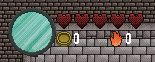
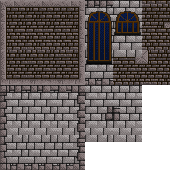

# Woche 6

## Zusammenfassung 

Diese Woche habe ich einen Teil der graphischen Oberfläche hinzugefügt und der Spielfigur ein paar Stats gegeben. Zum Ende der Woche habe ich ein neues Tileset erstellt und ein neues Testlevel gebaut. 

## StatsComponent

Das StatsComponent speichert alle wichtigen Werte für ein Entity. In diesem Fall habe ich die Werte Leben, Mana, Gold, Seelen, Angriffswert und Angriffsgeschwindigkeit. Die Angriffsgeschwindigkeit soll später definieren, wie lange man warten muss um wieder Angreifen zu können. Gold und Seelen sind zwei Währungen, die später für verschiedenen Boni eingetauscht werden können.

```c++
class StatsComponent : public Component{
public: 
	int maxHealth = 0; 
	int curHealth = 0; 
	int maxMana = 0; 
	int curMana = 0; 
	int money = 0; 
	int souls = 0;

	int attackDamage = 0; 
	int attackSpeed = 0; 

	StatsComponent(int mH, int mM, int money, int aD, int aS);
};
```


## Hud 

Um die Werte der Spielfigur anzuzeigen wurde die Klasse HudManager erstellt. Diese zeichnet alle wichtigen Informationen in die obere Linke Ecke. 



Die blaue Flüssigkeit ist Mana. Der Füllstand ist abhängig von dem aktuellen Mana.

```c++
float manaHeight = 48 * static_cast<float>(playerStats->curMana) / static_cast<float>(playerStats->maxMana);

SDL_Rect srcRect = { 0,48 - manaHeight,48,manaHeight};
SDL_Rect destRect = { 10,10 + (48 - manaHeight),48,manaHeight };

TextureManager::draw(mana, srcRect, destRect, SDL_FLIP_NONE);
srcRect = { 0,0,48,48 };
destRect = { 10,10,48,48 };
TextureManager::draw(manaTank, srcRect, destRect, SDL_FLIP_NONE);
```

Die Herzen zeigen das Leben des Spielers an. Wird eines verloren wird die durch ein graues Herz gezeigt. 

```c++
for (int i = 0; i < playerStats->maxHealth; i++) {
    if (i < playerStats->curHealth) {
        TextureManager::draw(fullHeart, srcRect, destRect, SDL_FLIP_NONE);
    }
    else {
        TextureManager::draw(emptyHeart, srcRect, destRect, SDL_FLIP_NONE);
    }
    destRect.x += 18; 
}	
```

Die Anzahl an Gold und Seelen werden durch die beiden Zahlen mit dem jeweiligen Symbol dargestellt.

```c++
TextureManager::draw(moneyIcon, srcRect, destRect, SDL_FLIP_NONE);
destRect.x += 18;
destRect.y -= 3;
std::stringstream strs;
strs << playerStats->money;
std::string temp_str = strs.str();
char* char_type = (char*)temp_str.c_str();
TextureManager::drawText(char_type, destRect, font, color);
destRect.x = 110;
destRect.y += 3;
TextureManager::draw(soulIcon, srcRect, destRect, SDL_FLIP_NONE);
destRect.x += 18;
destRect.y -= 3;
strs.str("");
strs << playerStats->souls;
temp_str = strs.str();
char_type = (char*)temp_str.c_str();
TextureManager::drawText(char_type, destRect, font, color);
```

## drawText

Für das Anzeigen von Schrift wurde eine neue Funktion der Klasse TextureManager hinzugefügt. Diese erstellt für den übergebenen Text eine Textur mit dem angegebenen Font mit einer beliebigen Schriftart.

```c++
void TextureManager::drawText(const char* text, SDL_Rect destRect, TTF_Font* font, SDL_Color color) {	
	SDL_Surface* surface = TTF_RenderText_Solid(font, text, color);
	destRect.w = surface->w;
	destRect.h = surface->h;
	SDL_Texture* message = SDL_CreateTextureFromSurface(Game::renderer, surface);
	SDL_RenderCopy(Game::renderer, message, NULL, &destRect);
	SDL_FreeSurface(surface);
	SDL_DestroyTexture(message);
}
```


## Tileset

Das Spiel wird in einer Burg stattfinden. Dafür habe ich ein kleines Tileset erstellt, was den Boden, Wände, Hintergrundwände und Fenster beinhaltet. 



## TileMap

Die Maps werden von nun an in drei Ebenen eingeteilt. Vordergrund, Mittelgrund in Hintergrund. Die Spielfigur bewegt sich auf dem Mittelgrund. Aktuell habe ich nur eine provisorische Erweiterung der loadMap() Funktion vorgenommen, aber dies wird sich in der nächsten Woche ändern. Dort habe ich vor ein dynamisches Laden und Rendern in der richtigen Reihenfolge zu implementieren.

```c++
std::fstream mapFile ("assets/levels/"+path+"_background.map"); 
std::string line;	

int x = 0;
int y = 0;

while (std::getline(mapFile, line)) {
    std::stringstream s(line);
    std::string cell; 
    while (std::getline(s, cell, ',')) {
        if (cell != "-1") {
            srcX = (stoi(cell) % TILESET_WIDTH) * TILE_WIDTH;
            srcY = (stoi(cell) / TILESET_WIDTH) * TILE_HEIGHT;
            addTile(srcX, srcY, x * TILE_WIDTH, y * TILE_HEIGHT);
        }
        x++;
    }
    if (x > width) {
        width = x; 
    }
    x = 0; 
    if (y > height) {
        height = y;
    }
    y++;		
}

mapFile.close();	

mapFile.open("assets/levels/" + path + "_midground.map");

x = 0; 
y = 0;

while (std::getline(mapFile, line)) {
    std::stringstream s(line);
    std::string cell;
    while (std::getline(s, cell, ',')) {
        if (cell != "-1") {
            srcX = (stoi(cell) % TILESET_WIDTH) * TILE_WIDTH;
            srcY = (stoi(cell) / TILESET_WIDTH) * TILE_HEIGHT;
            addTile(srcX, srcY, x * TILE_WIDTH, y * TILE_HEIGHT);
        }
        x++;		
    }
    x = 0;
    y++;

}
```

